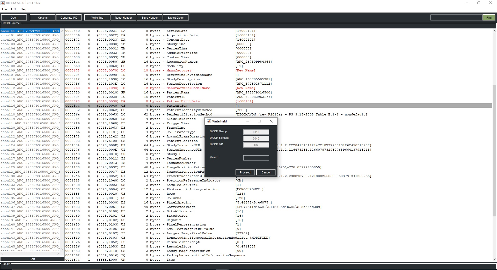

  <h1>DICOM Multi-files Editor</h1>
  
<strong>The DICOM Multi-files Editor is a DICOM header viewer and editor for research provided by <a href="https://daniellafontaine.com/projects/dicom-multi-files-editor/">Daniel Lafontaine</a>.

## Features

- View and modify DICOM tags of all slices
- Set a custom DICOM dictionary
- Add your own private field and save a new dicom set
- Dump DICOM Header to text file

## MATLAB tested version

* MATLAB 2024a

## Installation

* https://github.com/dicomtools/DicomMultiFilesEditor/wiki/Source-code-version-of-dicomMultiFilesEditor

## Reference

Visit https://daniellafontaine.com/ for more information
